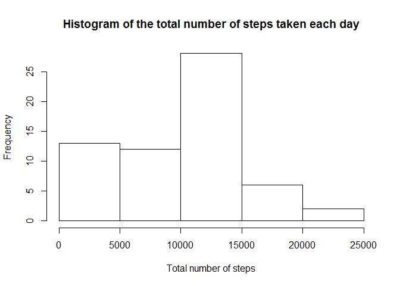
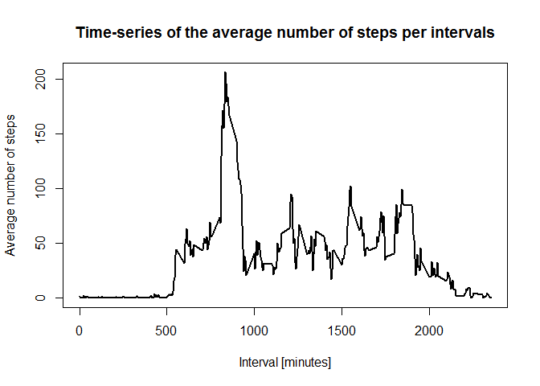
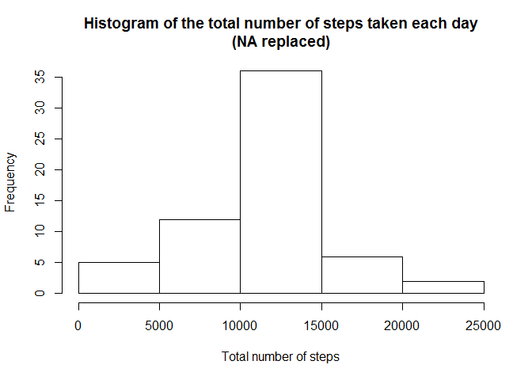

# Reproducible Research: Peer Assessment 1

library(ggplot2)


```r
## Loading and preprocessing the data

# 1.Load the data
activitydatainitial <- read.csv("./activity/activity.csv")

# 2.Transform the data into a format suitable for the analysis

# Changing the date attribute to actual date format
activitydatainitial$date <- as.POSIXct(activitydatainitial$date, format="%Y-%m-%d")

# Calculate the weekdays from the date attribute
activitydatainitial <- data.frame(date=activitydatainitial$date, 
                           weekday=tolower(weekdays(activitydatainitial$date)), 
                           steps=activitydatainitial$steps, 
                           interval=activitydatainitial$interval)
                           
# Calculate the day type (weekend or weekday)
activitydatainitial <- cbind(activitydatainitial, 
                      daytype=ifelse(activitydatainitial$weekday == "saturday" | 
                                     activitydatainitial$weekday == "sunday", "weekend", "weekday"))     
                                     
# Create the final data.frame for analysis
activitydata <- data.frame(date=activitydatainitial$date, 
                       weekday=activitydatainitial$weekday, 
                       daytype=activitydatainitial$daytype, 
                       interval=activitydatainitial$interval,
                       steps=activitydatainitial$steps)     

## What is mean total number of steps taken per day?

# 1.Calculate the total number of steps taken per day with NA values removed
totalstepsperday <- aggregate(activitydata$steps, by=list(activitydata$date), FUN=sum, na.rm=TRUE)

# Give meaningful names to the columns
names(totalstepsperday) <- c("date","total")

# Draw the histogram of the total number of steps each day
hist(totalstepsperday$total, 
     xlab="Total number of steps", 
     main="Histogram of the total number of steps taken each day")
```

<!-- -->

```r
# Calculate the mean and median of the total number of steps taken per day

mean(totalstepsperday$total)
```

```
## [1] 9354.23
```

```r
median(totalstepsperday$total)
```

```
## [1] 10395
```

```r
## What is the average daily activity pattern?
```

```r
# Compute the means of steps across all days for each interval
meandata <- aggregate(activitydata$steps, 
                       by=list(activitydata$interval), 
                       FUN=mean, 
                       na.rm=TRUE)

# Give meaningful names to the columns
names(meandata) <- c("interval","mean")

# 1.Compute the time series plot
plot(meandata$interval, 
     meandata$mean, 
     type="l", 
     lwd=2, 
     xlab="Interval [minutes]", 
     ylab="Average number of steps", 
     main="Time-series of the average number of steps per intervals")
```

<!-- -->

```r
# Position of the maximum mean
posmax <- which(meandata$mean == max(meandata$mean))

# 2.The 5-minute interval, on average across all the days in the dataset that contains the maximum number of steps i.e. Value of interval at the max position

meandata[posmax, 1]
```

```
## [1] 835
```

```r
## Imputing missing values
```

```r
# 1.Total number of missing values in the dataset
sum(is.na(activitydata$steps))
```

```
## [1] 2304
```

```r
# 2.Strategy is to replace each NA value by the mean of the steps attribute

# Find the NA positions
na_pos <- which(is.na(activitydata$steps))

# Create a vector of means
mean_vec <- rep(mean(activitydata$steps, na.rm=TRUE), times=length(na_pos))

# 3.A new dataset that is equal to the original dataset but with the missing data filled in with the vector of means

# Replace the NAs by the means
activitydata[na_pos, "steps"] <- mean_vec

# 4.Make a histogram of the total number of steps taken each day

# Calculate the total number of steps each day with NA values replaced
stepsperday <- aggregate(activitydata$steps, by=list(activitydata$date), FUN=sum)

# Give meaningful names to the columns
names(stepsperday) <- c("date", "total")

# Draw the histogram of the total number of steps each day
hist(stepsperday$total, 
     xlab="Total number of steps", 
     main="Histogram of the total number of steps taken each day\n(NA replaced)")
```

<!-- -->

```r
# Calculate the mean and median total number of steps taken per day
mean(stepsperday$total)
```

```
## [1] 10766.19
```

```r
median(stepsperday$total)
```

```
## [1] 10766.19
```

```r
## Are there differences in activity patterns between weekdays and weekends?
```

```r
# Compute the average number of steps taken, averaged across all daytype variable
meandata <- aggregate(activitydata$steps, 
                       by=list(activitydata$daytype, 
                               activitydata$weekday, activitydata$interval), mean)

# Give meaningful names to the columns
names(meandata) <- c("daytype", "weekday", "interval", "mean")

library(lattice)

# Compute the time series plot
xyplot(mean ~ interval | daytype, meandata, 
       type="l", 
       lwd=1, 
       xlab="Interval", 
       ylab="Number of steps", 
       layout=c(1,2))
```

<!-- -->

